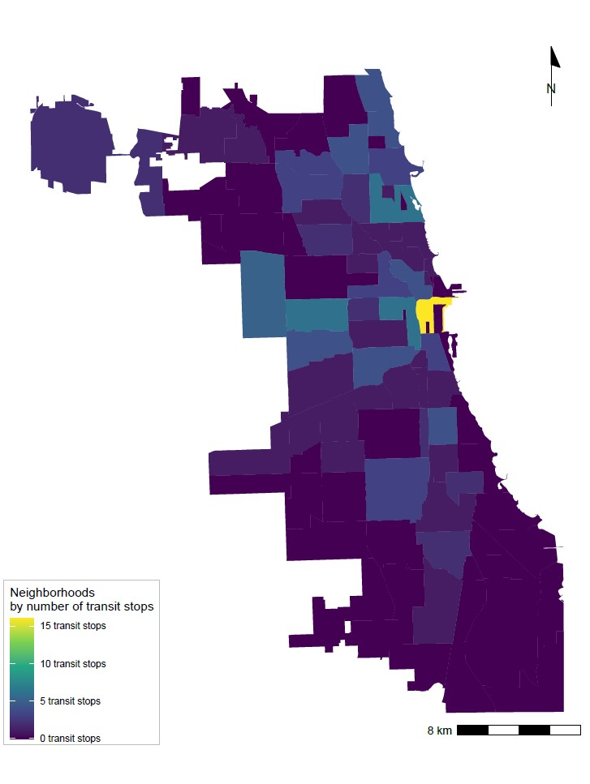

```{r setup, include=FALSE}
knitr::opts_chunk$set(echo = TRUE)
```

This portfolio demonstrates the key skills I have developed over the course of the VIS 2128 Spatial Analysis module. 

Through this course I have learned how to seek out and use data to explore questions and try to devise answers about cities throughout the United States. For the purposes of this portfolio, I am focusing on maps of Chicago, Illinois, and Cambridge, Massachusetts, and its surrounding counties. I hope to build on these skills as my research interests continue to come into focus. 


Thank you to Prof. Carole Voulgaris and TAs Emma Colley, Jonathan Lee, and Megan Willis-Jackson for their support in this module.  

# Chicago
In these four maps of Chicago, IL, I explore how the city's landscape changed over time, and where the current city government envisions more development in the coming years. 

## Georeferenced Map

Using a historical map of Chicago, from 1898, this image incorporates a layer of contemporary green spaces in Chicago to see how the city has evolved over time, particularly along Lake Michigan. As the map shows, one of the city's large park areas, where Grant Park is today, is a fairly recent human-made construction, built out into the lake in the twentieth century. 

This map demonstrates the following skills:

* Displaying raster data on a map
* Georeferencing a raster image

[](https://spage17.github.io/vis2128_portfolio/fullsize/georeference.pdf){target="_blank"}


## Spatial Relationships

These maps explore the spread of transit stops in relation to two polygon layers: neighborhood boundaries, and Enterprise Zones, a designation made by a citywide program that aims to stimulate economic and neighborhood growth in six economically depressed areas throughout Chicago. 

These maps demonstrate the following skills: 

* Displaying multiple vector layers on the same map
* Calculating and displaying relationships among point and polygon layers based on distance
* Aggregating point data to a layer of polygons


The first map shows a concentration of transit stops around the city center, the same part of the city where Grant Park is located.

[](https://spage17.github.io/vis2128_portfolio/fullsize/chicago2.pdf){target="_blank"}

This second map illustrates the proportion of transit stops within 1000 meters, about a 10 minute walk, of an Enterprise Zone.

[](https://spage17.github.io/vis2128_portfolio/fullsize/chicago1.pdf){target="_blank"}

This third map builds upon this by illustrating that 5 of the city's 6 Enterprise Zones contain a transit stop. This analysis could be useful as the city considers where to invest in more transit development to aid in certain areas' economic growth. 

[](https://spage17.github.io/vis2128_portfolio/fullsize/chicago3.pdf){target="_blank"}


# Cambridge
Through these maps of Cambridge, MA, I learned more about my new surroundings, namely in terms of the accessibility of public schools throughout the city, and how the population of foreign-born residents compares with adjacent areas. 

## Accessibility

These maps illustrate the accessibility of public schools in Cambridge by walking. 

These maps demonstrates the following skills:

* Calculating and displaying accessibility, based on travel time
* Displaying raster data on a map
* Converting between raster layers and vector layers


This first map uses isochrones to show walking times to the nearest public school in 10-, 20-, and 30-minute blocks of time. 

[](https://spage17.github.io/vis2128_portfolio/fullsize/cambridge_iso.pdf){target="_blank"}

This map uses black and white raster data to illustrate accessibility, displaying a score assigned by the r5r package. 

[](https://spage17.github.io/vis2128_portfolio/fullsize/access_raster_p.pdf){target="_blank"}

This map is a version of the raster map converted back to a vector layer, using colored points to illustrate the same accessibility score. 

[](https://spage17.github.io/vis2128_portfolio/fullsize/cambridge_access_points.pdf){target="_blank"}


## Interactive Map

This map illustrates the percentage of residents in Suffolk and Middlesex counties who were born outside of the United States, divided by census tracts. Including both counties allows for a comparison of the proportion of foreign-born residents outside the heart of Boston's metropolitan area. 

This interactive map demonstrates the following skills: 

* Displaying data on an interactive map

[](https://spage17.github.io/vis2128_portfolio/fullsize/interactive_map.html){target="_blank"}
