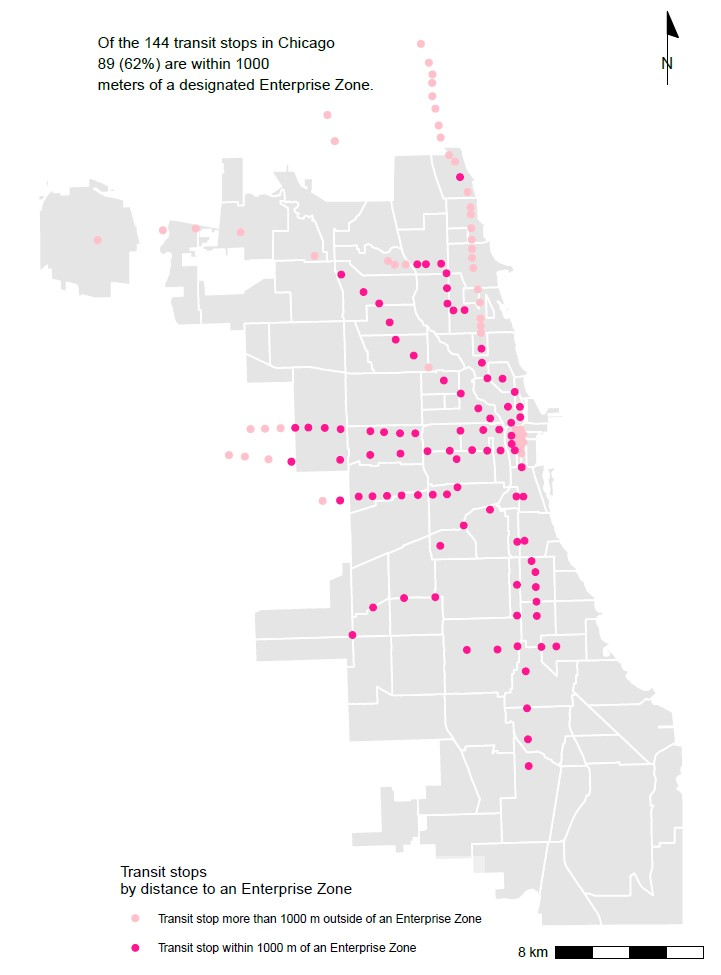
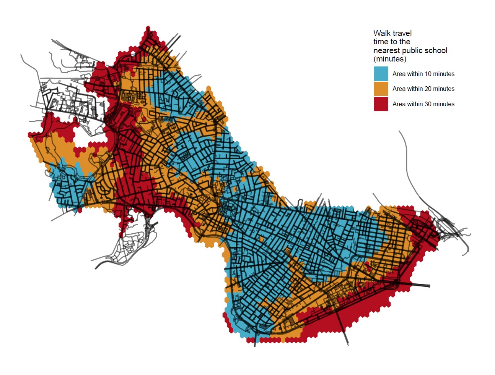
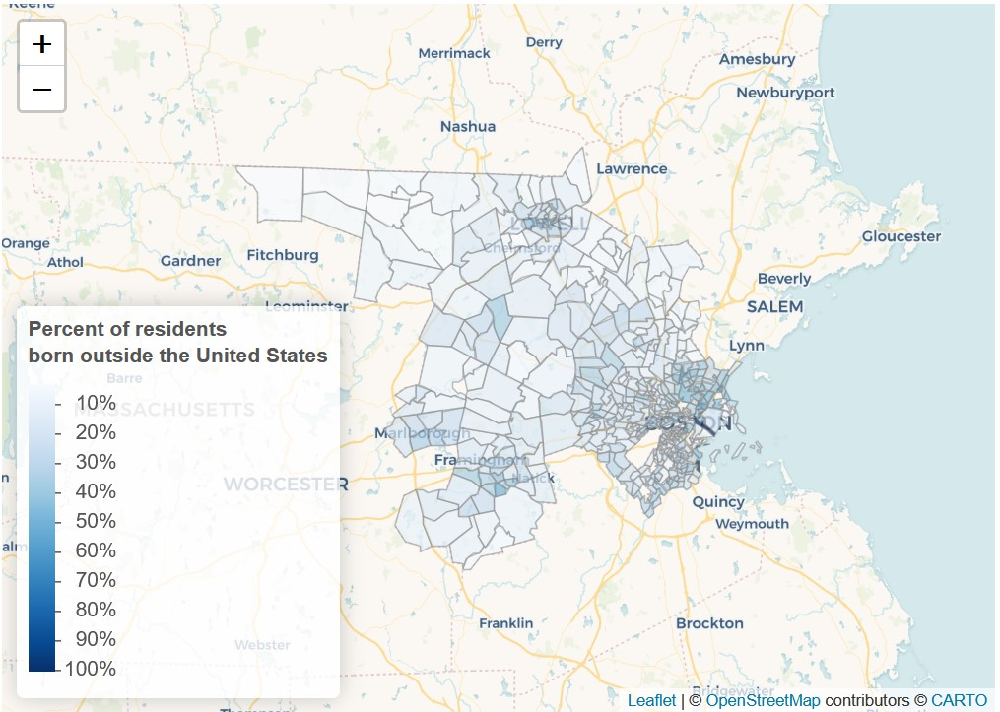

```{r setup, include=FALSE}
knitr::opts_chunk$set(echo = TRUE)
```

This is an example of a portfolio that someone might assemble to demonstrate the skills they have developed in VIS 2128. I have created this page using RMarkdown. There are fancier tools out there for creating and hosting webpages, and you are welcome to use any of those if you like. The advantage of this approach is that you can create your webpage directly from RStudio.

Your portfolio should demonstrate each of the following skills (not all of which are demonstrated in this example):

* Displaying multiple vector layers on the same map
* Calculating and displaying relationships among point and polygon layers based on distance
* Aggregating point data to a layer of polygons
* Calculating and displaying accessibility, based on travel time
* Converting between raster layers and vector layers
* Displaying raster data on a map
* Georeferencing a raster image
* Displaying data on an interactive map

# Chicago
Here are XXX maps of Chicago, IL. TKTK

## Georeferenced Map

Using a historical map of Chicago, from 1898, this image incorporates a layer of contemporary green spaces in Chicago to see how the city has evolved over time, particularly along Lake Michigan. 

This map demonstrates the following skills:

* Displaying raster data on a map
* Georeferencing a raster image

[](https://spage17.github.io/vis2128_portfolio/fullsize/georeference.html){target="_blank"}


## Spatial Relationships

These maps explore the spread of transit stops throughout Chicago, quantifying the relationship between transit stops and neighborhoods, as distinguished by formal city boundaries, and between transit stops and Enterprise Zones, a citywide program that aims to stimulate economic and neighborhood growth in six economically depressed areas throughout Chicago. 

These maps demonstrate the following skills: 

* Displaying multiple vector layers on the same map
* Calculating and displaying relationships among point and polygon layers based on distance
* Aggregating point data to a layer of polygons

[](https://spage17.github.io/vis2128_portfolio/fullsize/chicago2.html){target="_blank"}

[](https://spage17.github.io/vis2128_portfolio/fullsize/chicago1.html){target="_blank"}


# Cambridge
Here are XXX maps of Cambridge, MA. TKTK

## Accessibility

These maps illustrate the accessibility by walking of public schools and bus stops in Cambridge. The map with isochrones shows walking time to the nearest public school in 10-, 20-, and 30-minute blocks of time. The black and white map demonstrates accessibility using raster data and displays the accessibility of bus stops in Cambridge using a score assigned by the r5r package. The map with points plotted is a version of the raster map converted back to a vector layer and plotted as points. It illustrates the accessibility of public schools to pedestrians in Cambridge. 

These maps demonstrates the following skills:

* Calculating and displaying accessibility, based on travel time
* Converting between raster layers and vector layers
* Displaying raster data on a map

[](https://spage17.github.io/vis2128_portfolio/fullsize/cambridge_iso.html){target="_blank"}

[](https://spage17.github.io/vis2128_portfolio/fullsize/access_raster_b.html){target="_blank"}

[](https://spage17.github.io/vis2128_portfolio/fullsize/cambridge_access_points.html){target="_blank"}

## Interactive Map

This map illustrates the percentage of residents in Suffolk and Middlesex counties who were born outside of the United States, divided by census tracts. 

This interactive map demonstrates the following skills: 

* Displaying data on an interactive map

[](https://spage17.github.io/vis2128_portfolio/fullsize/interacive_map.html){target="_blank"}
